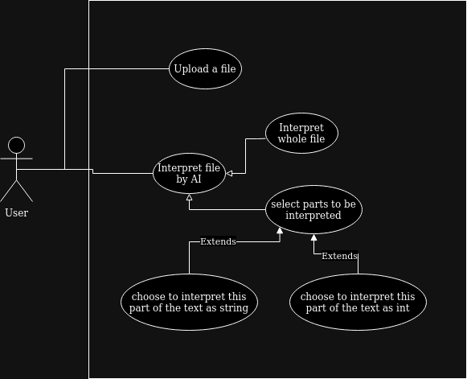

Version 1.0

# 1. Introduction

## 1.1 Purpose

    In day to day life, in office setting, or any job that require filling out of the forms
it's inivitable that you would need to retype the content of a phisical paper and or someones hand writing.
To help make the process faster and more effitient this project a solution that will use AI to identify the
content of photo and provide it in a text form.

## 1.2 Scope

    This project is a web-based photo to text system. System will provide an ability to upload files to it.
It will provide an option to select a Specific text to be interpreted by AI or an option to interpret whole page.

## 1.3 Definitions, acronyms, and abbreviations

## 1.4 References

# 2. Overall Description

## 2.1 Product Perspective

{TEMP}
- web server
...

## 2.2 Product Functions

## 2.2.1 Use case diagram

# 3. Specific requirements

## 3.1 Functional requirements

## 3.2 Non-functional requirements

## 3.3 Logical database requirements
